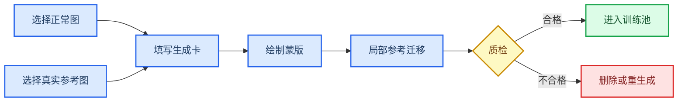

# 500多效极润标签褶皱分类评估报告（修订版）

## 1. 评估范围

- 训练方案：`D:\biaoqian\pang\训练方案.md`
- 正常源图（无褶皱）：`D:\biaoqian\yj\500多效极润\好样品`，共 456 张，即 114 个四视角正常瓶组。
- 真实褶皱参考图：`D:\biaoqian\yj\500多效极润\不良品`，共 224 张，即 56 个四视角褶皱瓶组。
- 图片结构：1、2、3、4 四个目录分别对应四个相机。
- 只读目录复核结果：好样品的每个相机目录均为 114 张；不良品的每个相机目录均为 56 张。按拍摄时间顺序合并后，分别为 114 个正常瓶组和 56 个褶皱瓶组，每组 4 个视角。

本报告将正常源图、真实褶皱参考图和生成图的用途区分开：正常图是无褶皱来源，真实褶皱图是参考依据；每张正常图可与同类真实褶皱参考图和局部蒙版独立生成训练图，不要求同一瓶四视角中的褶皱物理连续。生成图只能进入训练集，真实图用于验证集和测试集；同一正常瓶的四个视角及其全部派生图必须保持在同一数据划分。

### 补充目录核验

补充检查了 `D:\biaoqian\yj\dataset\实拍缺陷`。该目录同样包含 224 张 JPG，但逐文件名和 SHA-256 哈希比对后，224 张全部与 `D:\biaoqian\yj\500多效极润\不良品` 中的图片完全相同；没有新增图片或新增瓶组，只是目录组织方式不同。因此两个目录合计仍是 56 个独立瓶组，不能按 112 个瓶组统计。

这两个目录不能同时作为独立数据源合并后再随机划分，否则同一图片可能分别进入训练集与验证/测试集，造成直接数据泄漏和指标虚高。正式建库应先按文件哈希去重，再按时间瓶组划分；对改名、缩放或重新压缩的副本，还应使用感知哈希或图像相似度复核。

## 2. 总结论

现训练方案的训练与验证流程总体合理，尤其是按完整瓶组划分数据、真实图片用于验证和测试、按整瓶漏检率选择模型等做法是正确的。

但方案目前没有形成完整、可执行的“褶皱分类体系”。文中的“轻微/中等/严重”“标签中央/边缘/弯曲区域”“反光/暗光”等内容，本质上是数据分层和覆盖维度，不是互斥、定义清楚的缺陷类别。直接用于标注时会出现标注员理解不一致、同一褶皱可同时属于多个类别、类别样本不平衡等问题。

检测模型与生成大模型使用不同的分类层，不能混用。推荐部署的 YOLO 检测模型只设一个检测类别：`wrinkle（褶皱）`；褶皱形态、严重度、位置和成像难度等只作为生成卡控制维度或统计属性，用于生成控制、数据平衡和分项评估，不直接拆成多个 YOLO 检测类别。

由于用户明确说明这些图片仅代表全部褶皱中的一部分，当前形态字典只能作为当前样本支持的开放式初版（V0.1），不代表所有褶皱形态。后续每批真实样本都应进行形态审查，并允许扩展属性字典；单一 `wrinkle` 检测类不需要随形态字典扩展而改变。

## 3. 图片中实际出现的主要形态

56 个瓶组至少包含以下形态，现方案未显式覆盖这些形态定义：

| 形态属性 | 判定说明 | 本批图片中的典型时间顺序瓶组 |
| --- | --- | --- |
| 线状折痕 | 单条或少量细长折脊，可为斜向、竖向或近横向 | 18、23、38、45、50、53 |
| 横向/环带波纹 | 一条或多条近水平褶皱，沿瓶身周向延伸，可能跨两个以上相机 | 12、19、31、32、43、48、49 |
| 放射/扇形聚皱 | 多条折脊从一点或局部区域向外发散，常伴随明显局部隆起 | 6、9、22、30、34、44、46 |
| 大片牵拉或折叠 | 三角形、片状、竖向或斜向大折叠，可能遮挡或扭曲文字 | 1、3、4、8、16、25、37、42、47 |
| 复合型 | 同一连续缺陷同时包含明显聚皱和大片折叠，无法用单一形态概括 | 15、27、35、39、52、54、55、56 等 |
| 其他/待定 | 当前形态字典不能可靠描述的新形态；需进入复核池，而不是强行归入相近类别 | 本批未确认，供后续扩展使用 |

人工形态审查或外部统计台账可记录主形态和次形态，以保留瓶级观察；该记录不属于生成卡，也不得写入生成任务 JSON。生成任务的 `shape` 必须是一个单一允许值；同一连续缺陷无法由单一基础形态概括时，统一填写标量 `mixed`，不得把 `shape` 写成数组、不得新增 `secondary_shape` 或其他 JSON 键。`other_unknown` 样本应定期集中复核：如果同类新形态反复出现，再新增正式形态属性并回标历史样本。

## 4. 推荐的分类结构

### 4.1 模型检测类别

```yaml
names:
  0: wrinkle
```

原因：生产判定最终是“是否存在褶皱”，而且同一缺陷可以同时具有形态、严重度和位置等多个属性。把这些属性拆成 YOLO 类会造成类别重叠。先训练一个褶皱类，更容易获得稳定召回率，也便于后续扩充数据。

### 4.2 生成卡控制属性与统计属性

生成大模型使用多属性生成卡来控制内容；这些属性不是 YOLO 类，也不组合成新的检测类别名。这八个属性（`shape`、`severity`、`direction`、`height_zone`、`boundary_relation`、`content_zone`、`curvature`、`visibility`）也可用于抽样平衡和分项召回率统计；其唯一的字段与枚举规范见本节后文“多属性生成卡字段”表，生成卡必须恰好使用这八个属性。

`other_unknown` 只进入人工复核池，不直接自动生成。原始图片如含相机目录或文件名信息，仅通过 `source_normal_image` 和 `reference_defect_image` 路径追溯，不解析为生成控制属性。

### 4.3 用于大模型迁移生成的分类方案

本方案只控制局部参考迁移生成，不改变检测分类：YOLO 始终只有单一 `wrinkle` 类。每张正常图独立生成，不要求同一瓶四个视角中的褶皱物理连续；但同一正常瓶的四张源图及其全部派生图必须保持在同一数据划分。

基础形态 `linear`、`band`、`radial`、`large_fold` 优先生成；只有四类基础形态分别验证合格后，才生成 `mixed`。`mixed` 的执行策略唯一且保守：仅在存在一张真实 `mixed` 同类参考图时发起单张参考迁移；找不到该参考图即标记 `no_reference`。本版不采用两次基础形态叠加，不支持两个参考图，也不增加任何生成卡或 JSON 字段。`other_unknown` 不自动生成，只进入人工复核池。

#### 多属性生成卡字段

每个字段和允许值必须严格使用下表；这八个字段共同组成生成控制维度，而非 YOLO 类别。

| 字段 | 允许值 |
| --- | --- |
| `shape` | `linear` \| `band` \| `radial` \| `large_fold` \| `mixed` |
| `severity` | `S1` \| `S2` \| `S3` |
| `direction` | `horizontal` \| `vertical` \| `diagonal` \| `multi_direction` |
| `height_zone` | `top` \| `middle` \| `bottom` \| `cross_zone` |
| `boundary_relation` | `interior` \| `top_edge` \| `bottom_edge` \| `side_edge_or_overlap` |
| `content_zone` | `blank` \| `text` \| `logo` \| `dark_block` \| `cross_content` |
| `curvature` | `front_facing` \| `curved_transition` |
| `visibility` | `high_contrast` \| `low_contrast` \| `reflection_interference` \| `frame_edge` |

生成卡不设置、推断或填写相机属性。追溯只保存 `source_normal_image`、`reference_defect_image` 和 `mask_path` 等路径；即使原始路径中带有相机目录或文件名，也不将其解析成控制字段。

#### JSON 生成卡示例

```json
{
  "task_id": "gen_000001",
  "source_normal_image": "D:/biaoqian/yj/500多效极润/好样品/1/1_20260426162046125.jpg",
  "reference_defect_image": "D:/biaoqian/yj/500多效极润/不良品/4/瓶组18_线状折痕_相机4_示例.jpg",
  "mask_path": "masks/gen_000001.png",
  "shape": "linear",
  "severity": "S1",
  "direction": "diagonal",
  "height_zone": "top",
  "boundary_relation": "interior",
  "content_zone": "blank",
  "curvature": "front_facing",
  "visibility": "low_contrast",
  "seed": 5201,
  "version": 1
}
```

#### 参考图匹配与生成约束

参考缺陷图必须按以下顺序匹配：形态一致 → 严重度一致 → 曲率及边界关系相近 → 方向适配 → 光照和印刷内容兼容。`mixed` 任务只能匹配一张真实 `mixed` 参考图，不能以两个基础形态参考图或两次编辑替代。不得按相机编号筛选参考图；只依据可见几何、曲率、边界关系、方向、光照和内容区域的兼容性选择。没有严重度和几何兼容的参考图，或 `mixed` 缺少真实同类参考图时，任务标记为 `no_reference`，不进行自由生成。

大模型只能修改蒙版区域和必要的窄过渡带，不得改写文字或 Logo，不得改变背景、瓶体、光源位置或图像尺寸；不得在标签未覆盖区域或标签间隙生成褶皱。生成输入固定为正常图、同类真实褶皱参考图和局部蒙版。



#### 质检、失败状态与数据使用

每张生成结果均检查：属性与生成卡一致；褶皱光影连续；蒙版外与正常源图一致；文字和 Logo 未破坏；无新增裂口、污渍、气泡等非目标缺陷；无复制粘贴边缘；无重复生成图。

审核状态与失败码分别记录：`accepted` 必须没有失败码，且只有 `accepted` 可以进入训练集；`rejected` 必须记录下表中的一个明确失败码，失败图片不得进入训练集；`needs_review` 是尚未裁定的人工状态，不得入训练，最终必须转为 `accepted` 或 `rejected`。同一任务若同时触发多个失败条件，应逐项记录失败原因，并以最先阻断任务或最严重的条件作为主失败码。

| 失败状态 | 确定触发条件 | 处置 |
| --- | --- | --- |
| `invalid_card` | 14 键 JSON 不可解析、键数不为 14、含未允许键或 `camera`；八属性缺失、增添、枚举非法；或所填属性组合在目标标签区域无法实现。 | 不生成或停止任务；修正卡片后重新校验和排队。 |
| `no_reference` | 找不到同时满足形态、严重度、几何兼容条件的一张真实褶皱参考图；`mixed` 任务找不到真实 `mixed` 同类参考图。 | 停止任务，不进行自由生成、两次叠加或双参考图替代；保留任务卡和匹配记录，待补充参考后重试。 |
| `outside_edit` | 生成结果在蒙版及必要窄过渡带以外发生可见改动，例如标签其他区域、瓶体、背景、光源位置或图像尺寸改变。 | `rejected`；保留卡片和差异证据，调整蒙版/迁移后重新生成。 |
| `content_corruption` | 文字或 Logo 被错误重绘，或其可读性、字形/Logo 几何、印刷内容被破坏。 | `rejected`；保留卡片和失败原因，修正约束或蒙版后重新生成。 |
| `attribute_mismatch` | 已生成褶皱的形态或任一八属性与生成卡不一致，包括严重度、方向、位置、边界关系、内容区域、曲率或可见性不符。 | `rejected`；保留卡片和对照结果，重新匹配参考或重新生成。 |

生成任务只使用训练集中的正常源图和真实缺陷参考图；生成图只进入训练集，验证集和测试集只使用真实图。同一正常瓶四张源图及其全部派生版本必须在同一划分；单张正常图不宜生成大量近似版本，应优先扩大正常瓶、形态和位置覆盖。

#### 可直接使用的中文提示词模板

```text
以正常图 {source_normal_image} 为底图，参考同类真实褶皱图 {reference_defect_image}，仅在蒙版 {mask_path} 及必要的窄过渡带内进行局部褶皱迁移。严格按生成卡生成：shape={shape}；severity={severity}；direction={direction}；height_zone={height_zone}；boundary_relation={boundary_relation}；content_zone={content_zone}；curvature={curvature}；visibility={visibility}。蒙版外必须与正常图完全保持不变；不得改写文字或 Logo，不得改变背景、瓶体、光源位置或图像尺寸，不得新增其他缺陷，也不得在标签未覆盖区域或标签间隙生成褶皱。
```

## 5. 严重度必须增加可操作定义

原训练方案只写了“轻微、中等、严重”，没有阈值，容易产生主观差异。建议先用下列规则作为初稿，再由质量部门按实际验收标准确认：

| 等级 | 建议定义 |
| --- | --- |
| S1 轻微 | 当前单张图中为单条或少量浅折脊，覆盖范围小、局部对比度低；无明显材料重叠或翘起，主要文字/Logo不受影响。 |
| S2 中等 | 当前单张图中折脊清晰，或多条褶皱形成局部波纹/小范围聚皱；相对标签可见区域具有中等覆盖范围或局部对比度，文字可出现变形但仍可辨认。 |
| S3 严重 | 当前单张图中出现大片折叠、材料重叠/翘起或明显放射状聚皱；覆盖较大标签区域，或关键文字/Logo发生明显扭曲、遮挡或难以识读，局部亮暗反差显著。 |

生成卡的 `severity` 只能按当前单张图中的上述可观察量填写，不得使用相机编号、其他视角或跨视角可见性。瓶级统计可以另行记录同一物理褶皱在多个视角出现的情况，但该信息不得用于填写生成卡严重度。严重度最好结合物理尺寸或相对标签尺寸制定量化阈值，例如缺陷长度占标签高度的比例、缺陷包围区域占可见标签面积的比例、是否存在材料重叠、是否影响关键文字。不能只根据检测框面积分级，因为细长斜向褶皱的轴对齐检测框会包含大量正常背景。

## 6. 标注规则还需补全

建议在训练方案中增加以下统一规则：

1. 同一相机中连续的一条折痕标一个紧框；互不相连、间隔明显的折痕分别标框。
2. 从同一点发散、构成一个连续聚皱区域的多条折痕，作为一个聚皱实例标一个框。
3. 同一物理褶皱若在两个相邻相机中都可见，两张图都要独立标注；整瓶统计时只算一个不良瓶，不能当成两个独立缺陷瓶。
4. 某个视角看不到褶皱时，该图不标框，但仍保留在同一瓶组中；整瓶只要一个视角检出即判 NG。
5. 对细长斜向折痕，框应覆盖完整可见折痕且尽量紧。若大量样本都是细长、分叉形状，应比较单类 YOLO Detect 与单类 YOLO Seg，分割标注更贴合此类形状，但成本更高。
6. 建立争议样本清单，由两名标注员独立标注并由质量人员裁决，形成边界案例图册。
7. 建库前生成全量图片清单，至少记录 `source_normal_image`、`reference_defect_image`、`sha256`、`perceptual_hash`、`bottle_group_id` 和 `split`；通过两条来源路径追溯原始目录信息，先去重、再分组、最后划分数据集。
8. 新出现但无法归入现有形态字典的褶皱仍按 YOLO 的单一 `wrinkle` 类标注，同时把形态属性记为 `other_unknown`，不能漏标或临时自创新类名。

## 7. 正常样本评估与必须保持的困难负样本

好样品的 456 张图像（114 个四视角正常瓶组）是无褶皱正常源图，也是界定正常外观边界的依据。生成模型在局部迁移时必须保持蒙版外内容，并且不得把正常外观误改为褶皱或其他异常。训练和验证中应专门保留下列正常但容易误报的困难负样本特征：

- 标签接缝或搭接边；
- 标签上下边缘；
- 印刷横线；
- 黑色色块；
- 文字笔画；
- 两侧光源亮条；
- 反光暗区；
- 瓶身轮廓和曲面纹理。
- 无褶皱但标签贴合纹理不均的正常瓶；
- 缺陷刚好位于两个相机交界处时，与其相邻的正常区域。

这些特征必须保持，且不应被生成模型误改；否则模型很可能把接缝、印刷线或反光当成褶皱。

## 8. 对现训练方案的具体评价

### 合理的部分

- 按四相机完整瓶组划分训练、验证和测试集，能避免同瓶数据泄漏。
- 好样品是无褶皱正常源图，不良品是真实褶皱参考图；真实图用于验证、测试，生成图只进训练集，方向正确。
- 已考虑严重度、位置、曲面、光照等覆盖维度。
- 最终按整瓶召回率和正常瓶误报率选择模型与阈值，符合流水线目标。

### 原训练方案中不完整或需修改的部分

- 没有明确最终使用一个褶皱类还是多个褶皱类。
- 缺少线状、环带、放射聚皱、大片折叠、复合型等形态覆盖。
- 严重度没有量化或可复现定义。
- “中央/边缘/弯曲区域”位置划分过粗，缺少上下区域、搭接边、关键文字区等信息。
- 缺少正负样本边界和困难负样本标注规范。
- 缺少同一缺陷跨相机可见时的实例标注和整瓶计数规则。
- 缺少标注一致性复核机制。
- 缺少跨目录、改名副本和重压缩副本的去重规则；当前两个实拍目录实际为同一批图片。
- 当前图片只是褶皱总体的一部分，形态字典必须明确为可扩展版本，不能宣称已穷尽全部形态。

## 9. 数据量风险

如果这 56 个瓶组就是全部真实不良样本，按 70%/15%/15% 划分后，验证集和测试集分别只有约 8 个褶皱瓶。该数量不足以同时覆盖形态、严重度、相机和位置，也不足以验证“整瓶召回率 ≥ 99%”：测试集中只漏 1 瓶，召回率就会从 100%降至 87.5%。

因此，这批图可以用于建立分类规则和初步训练，但正式验收需要增加独立的真实不良瓶组和正常瓶组。若目标是以统计置信度证明接近 99%的召回率，测试集通常需要数百个独立褶皱瓶，而不是按图片张数计算。

## 10. 建议写入训练方案的最终表述

> 检测模型与生成大模型使用不同分类层：YOLO 模型检测类别统一设为 `wrinkle`；生成模型使用无相机属性的八字段多属性生成卡，形态、严重度、方向、位置、边界关系、内容区域、曲率和成像难度仅作为生成控制或统计属性。基础形态优先生成，`mixed` 仅在基础形态验证合格后生成，`other_unknown` 只进入人工复核。好样品为 456 张无褶皱正常源图（114 个四视角瓶组），不良品为 224 张真实褶皱参考图（56 个四视角瓶组）；生成任务只使用训练集正常图和真实缺陷参考图，生成图只进训练集，验证和测试只用真实图。同一瓶四个相机图按时间归为一个瓶组，组内图片及其全部派生图不得跨数据集。同一物理褶皱可在多个视角独立标注，但整瓶评估只计一个瓶级结果。所有图片在划分前先按文件哈希和感知哈希去重，禁止同图或其改名、缩放、重压缩副本跨数据集。
